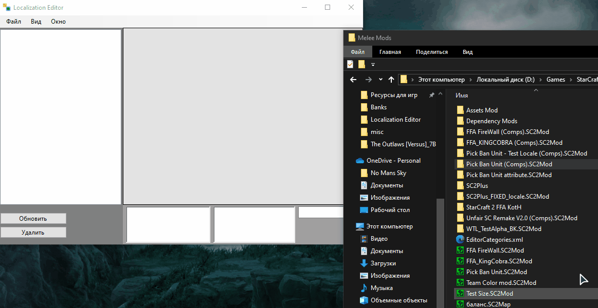
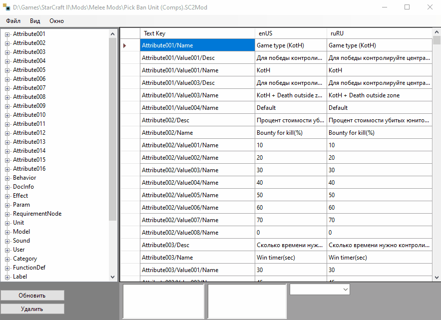

# Localization-Editor
 A program for viewing all localizations of any StarCraft 2 map at once

 ## How do I use the localizer?

 To use it, you need to run the EXE file "Localization Editor.exe ", and drag the StarCraft 2 map components folder into the program window

 

## How do I display only certain text keys?
In order to display only certain text keys, you need to click one of them in the TreeView of the left window.

 